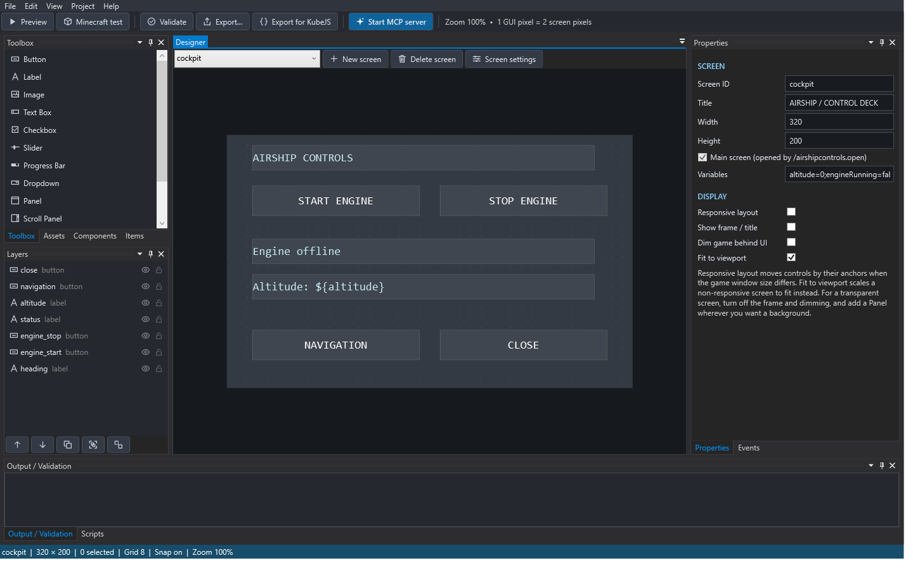

# Arcadia Studio manual

Arcadia Studio is a Windows app for designing Minecraft screens (menus, dashboards, control panels and shops) by dragging controls onto a canvas. You connect buttons to actions or JavaScript, preview everything on your desktop, and export a mod JAR that works in Minecraft Java Edition **1.21.1** with **NeoForge**. There's no Java code to write and no Minecraft restart needed while designing.

## Start here

1. [[Installing Arcadia Studio|Installing-Arcadia-Studio]]: download, install and first launch.
2. [[Quick start tutorial|Quick-Start-Tutorial]]: build a working screen in about ten minutes.
3. [[The workspace|The-Workspace]]: find your way around the window.

## Designing screens

- [[Projects and screens|Projects-and-Screens]]: saving, recovery, screen settings, the Main screen
- [[Controls reference|Controls-Reference]]: every control type and what it does
- [[Editing on the canvas|Editing-on-the-Canvas]]: selecting, moving, resizing, zoom, lock
- [[Properties and appearance|Properties-and-Appearance]]: colors, images, fonts, borders, shadows, conditions
- [[Layers and groups|Layers-and-Groups]]: stacking order, groups, isolation, eye and lock
- [[Panels and parenting|Panels-and-Parenting]]: putting controls inside panels
- [[Anchors and responsive layouts|Anchors-and-Responsive-Layouts]]: screens that adapt to the game window
- [[Align and distribute|Align-and-Distribute]]: lining things up
- [[Reusable components|Reusable-Components]]: build once, place many times
- [[Assets and Minecraft items|Assets-and-Items]]: images and item icons
- [[Pixel art and sprite sheets|Pixel-Art-and-Sprites]]: draw pixel art and make sprite animations
- [[Item lists and row templates|Item-Lists-and-Row-Templates]]: scrollable lists of items

## Making screens do things

- [[Events and actions|Events-and-Actions]]: what happens when someone clicks, types or opens a screen
- [[Scripting with JavaScript|Scripting]]: scripts, templates and the script API
- [[Preview|Preview]]: test your screen on the desktop
- [[Testing in Minecraft|Testing-in-Minecraft]]: launch a real game from the editor

## Shipping your project

- [[Exporting and installing|Exporting-and-Installing]]: export formats and putting them in Minecraft
- [[KubeJS integration|KubeJS-Integration]]: server scripts for KubeJS modpacks
- [[Security and permissions|Security-and-Permissions]]: for server owners

## Extras

- [[AI assistants (MCP)|MCP-and-AI-Assistants]]: let Claude, ChatGPT or another assistant build screens with you
- [[Keyboard shortcuts|Keyboard-Shortcuts]]: defaults and how to change them
- [[Addon API|Addon-API]]: for mod and KubeJS developers
- [[Limits and troubleshooting|Limits-and-Troubleshooting]]

## Requirements at a glance

| You want to… | You need |
| --- | --- |
| Design screens and preview them | Windows 10 or 11 (the editor includes its own .NET runtime) |
| Test inside Minecraft from the editor | Java **21** installed, internet for the first download, several GB of disk space |
| Use your screens in Minecraft | Minecraft Java **1.21.1** with NeoForge **21.1.250** or newer |
| Use KubeJS server scripts | KubeJS and Rhino installed in the modpack |

*This manual describes Arcadia Studio 1.3 (Minecraft runtime 1.7.0). Arcadia Studio was called Wysicraft before 1.3: projects from then (`.wysicraftproj`) still open, and your settings come across by themselves.*
