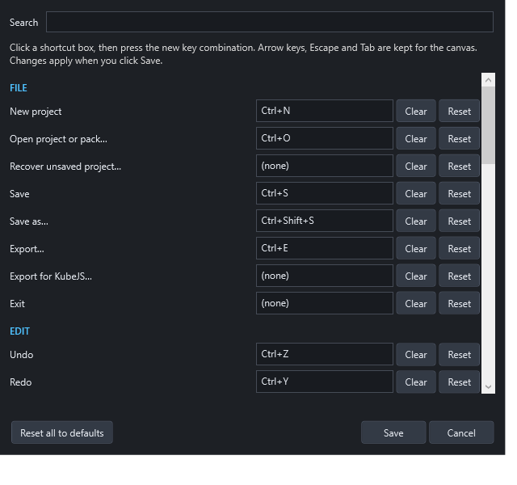

# Keyboard shortcuts

Every menu command shows its shortcut in the menu, and every command can be given a new one.

## Changing shortcuts

1. Open **View → Keyboard shortcuts…** (also in the Help menu).
2. Use **Search** to find a command by name or by its current keys.
3. Click the command's shortcut box and press the new combination.
4. If those keys are already used, you're asked whether to move them. The other command is then left without a shortcut.
5. **Clear** removes a shortcut. **Reset** restores one command's default. **Reset all to defaults** restores everything.
6. Click **Save**. Menus and tooltips update immediately.

Shortcuts are saved for your Windows user, separately from projects. Arrow keys, Escape and Tab can't be assigned, because the canvas uses them. Numpad keys work like their main-keyboard equivalents (numpad + is the same as +).

## Default shortcuts

### File
| Command | Default |
| --- | --- |
| New project | Ctrl+N |
| Open project or pack… | Ctrl+O |
| Save | Ctrl+S |
| Save as… | Ctrl+Shift+S |
| Export… | Ctrl+E |

### Edit
| Command | Default |
| --- | --- |
| Undo / Redo | Ctrl+Z / Ctrl+Y |
| Cut / Copy / Paste | Ctrl+X / Ctrl+C / Ctrl+V |
| Duplicate | Ctrl+D |
| Delete | Delete |
| Select all | Ctrl+A |
| Group / Ungroup | Ctrl+G / Ctrl+Shift+G |
| Attach to panel / Detach from panel | Ctrl+Shift+A / Ctrl+Shift+D |
| Bring forward / Send backward | Ctrl+] / Ctrl+[ |
| Bring to front / Send to back | Ctrl+Shift+] / Ctrl+Shift+[ |
| Rename the selected control | F2 |
| Lock / unlock selection | Ctrl+L |

### View
| Command | Default |
| --- | --- |
| Zoom in / Zoom out | Ctrl++ / Ctrl+- |
| Actual size | Ctrl+0 |
| Fit screen in window | Ctrl+9 |

### Project
| Command | Default |
| --- | --- |
| Preview | F5 |
| Test in Minecraft | Ctrl+F5 |
| Validate | F7 |

### Help
| Command | Default |
| --- | --- |
| User manual | F1 |

Other commands (Recover, Export for KubeJS, Isolate group, Show grid, Snap to grid, Reset panel layout, Screen settings, Project settings, Import texture, MCP server, Script API, About) have no default shortcut, but you can add one.

## Fixed keys

These aren't part of the shortcuts list:

| Keys | Do |
| --- | --- |
| Arrow keys / Shift+arrows | Nudge the selection 1 / 10 GUI pixels |
| Escape | Leave group isolation, or cancel a selection box |
| Ctrl + mouse wheel | Zoom toward the pointer |
| Alt-click | Select one member of a group |
| Shift-click / Ctrl-click | Add to the selection |
| Ctrl while resizing a panel | Resize without moving its children |
| Ctrl+Space in the script editor | Insert an API snippet |

## While typing

In text boxes and the script editor, keys behave normally: Ctrl+A, Ctrl+C and Ctrl+Z work on the text. **Save, New, Open, Preview, Minecraft test and Validate** still work while you type.

## In the Minecraft test

F6 opens your project, F7 closes it, F8 shows the test controls. Change these inside Minecraft under **Options → Controls → Key Binds → Wysicraft Test**.
